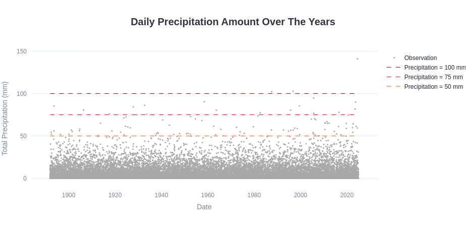
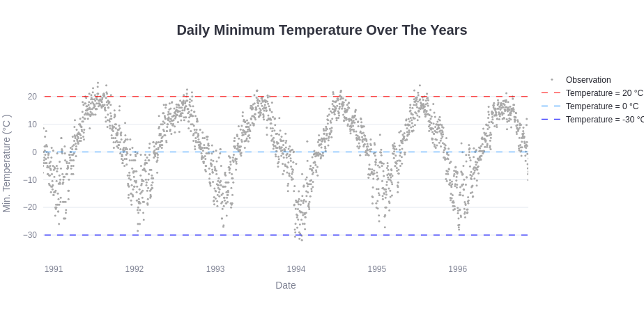
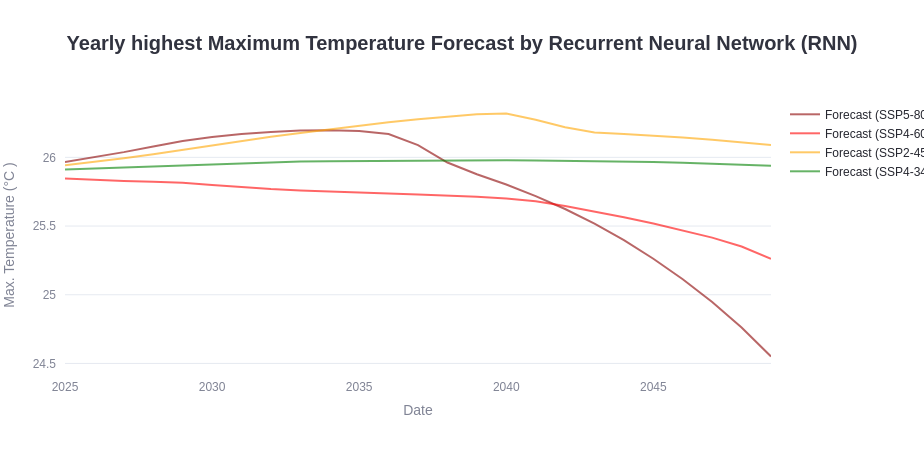
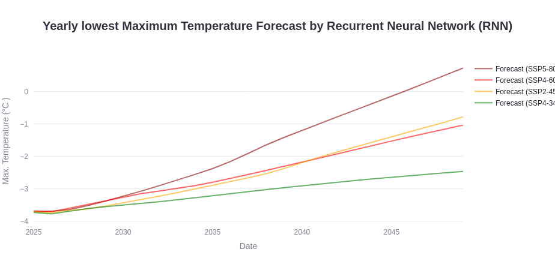
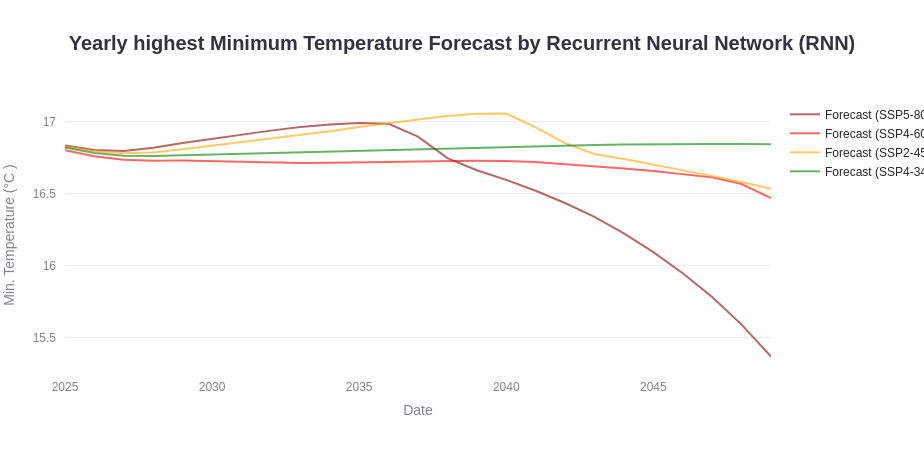
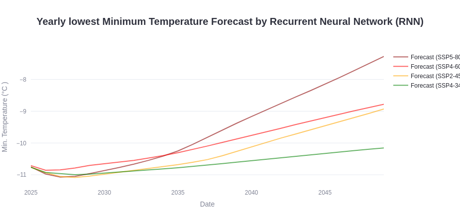

# Climate App Explorer and Climate Forecast for Downtown Montreal

</br>

Explore over a century of maximum/minimum temperature and precipitation data from downtown Montreal (McTavis/McGill). This project combines data analysis, modeling, and interactive visualization to understand historical climate patterns and explore future warming scenarios.

[Here](Final_Presentation.pptx) is an presentation summarizing the project. Feel free to go through the rest of this page for more details.

</br></br>


---
## Data

This project integrates a variety of datasets to analyze historical trends and to project our climate trends from our Recurrent Neural Network (RNN) model in downtown Montreal.

</br>

**Historic Daily Climate Data**

The historic climate data for downtown Montreal at the weather station McTavish/McGill is available since 1871. Our main focus for the analysis and visualization will be on maximum temperature, minimum temperature and precipitation. While we will focus solely on maximum and minimum temperature in our RNN model.

See the notebook [DataQuery](notebook/DataQuery.ipynb) to have more details about how the climate data were queried.

See the notebook [AdminRegion2stns](notebook/AdminRegion2stns.ipynb) to see how we retrieve a list of weather station within an administrative region.

</br>

**Grenhouse Gases (Carbon dioxide and Methane)**

 Carbon dioxide (CO2) and methane (CH4), even though there are more greenhouse gases (GHG) contributing to climate change than these two, were chosen since they have a great impact on climate change.

The forecast of the GHG are based from the Shared Socioeconomic Pathways (SSPs), which are climate change scenarios of projected socioeconomic global changes up to 2100 as defined in the IPCC Sixth Assessment Report on climate change in 2021. They are used to derive GHG emissions scenarios with different climate policies.

</br>

| Scenario  | Description                                                       |
|-----------|-------------------------------------------------------------------|
| **SSP4-34** | Intermediate GHG emissions with a desire to implement climate policies |
| **SSP2-45** | Low to intermediate GHG emissions with large social disparities  |
| **SSP4-60** | Intermediate to high GHG emissions with deep social inequalities |
| **SSP5-80** | Very high GHG emissions (worst case scenario)                    |

</br>


</br>


</br>

By using the CO2 and CH4 global mean concentration as an input features of my RNN model, I am hoping that it will be able to establish the connection between the GHG curves and the temperature. Thus, in its own way see the GHG impact on climate change.

</br>

**Montreal's Population**

Population density significantly impact the land surface of a city. The surface type consequently influence the surface albedo, its capacity to retain moisture, and so much more. When the population is dense enough and has changed the surface type from mainly vegetation to a dense building surface area, the urban heat island effect is created over the urban area. The Urban Heat Island Effect means that the urban area accumulate more heat than its surroundings rural areas and, consequently, the maximum temperature and minimum temperature will generally be warmer in the urban area than in the surroundings rural areas.

</br>


</br>

By using the Montreal's population as an input feature of my RNN model, I am hoping that it will be able to establish the connection between the population curve and the temperature. Thus, in its own way see the Urban Heat Island Effect.

</br>

**Sources**:
- Environment and Climate Change Canada
  - [Historic Climate Data](https://dd.weather.gc.ca/climate/observations/)
- Wikipedia
  - [Population census from Statistic Canada]( https://fr.wikipedia.org/wiki/Montr%C3%A9al) 
- Institut de la statistique du Québec
  - [Population predictions](https://statistique.quebec.ca/en/fichier/perspectives-demographiques-quebec-et-regions-2021-2071-edition-2024.pdf)
- IPCC & CMIP6 (climate projections, SSP scenarios)
  - [Greenhouse Gases Global Mean Concentration Predictions](https://greenhousegases.science.unimelb.edu.au/#!/view)
- Global Monitoring Laboratory (NOAA) for GHG concentrations
  - [CO2 Global Mean Concentration Observations (1959-2024)](https://gml.noaa.gov/webdata/ccgg/trends/co2/co2_annmean_mlo.txt)
  - [CH4 Global Mean Concentration Observations (1984-2023)](https://gml.noaa.gov/webdata/ccgg/trends/ch4/ch4_annmean_gl.txt)
- NASA - GHG concentrations monitoring
  - [CO2 Global Mean Concentration Observations (1850-2011)](https://data.giss.nasa.gov/modelforce/ghgases/Fig1A.ext.txt)
- SeaLevel.info
  - [CH4 Global Mean Concentration Observations (1010-1992)](https://sealevel.info/EthCH498B.txt)

</br>
 
**Included Variables for the visualization**:
- Daily maximum temperature (°C)
- Daily minimum temperature (°C)
- Daily precipitation amount (mm)
- Atmospheric carbon dioxide concentrations (ppm)
- Atmospheric methane concentrations (ppb)
- Population for Montreal

</br>

**Included Variables for the RNN model**:
- Daily maximum temperature (°C)
- Daily minimum temperature (°C)
- Atmospheric carbon dioxide concentrations (ppm)
- Atmospheric methane concentrations (ppb)
- Population for Montreal

</br></br>

---
## Data Pre-processing

Data needs to be avaiable on the same period and at the same timesteps without any gap in order to build our RNN model.

</br>

**Historic Daily Climate Data**

In order to fill in gaps of missing data for the weather station of Montreal (McTavish/McGill), we also retrieved the weather station reports from weather stations over Montreal's Island. We replaced any missing daily weather reports from the closest available station on that day. Once that processed was done, we had full years of consecutive daily weather reports for Montreal (McTavish/McGill) from 1892 to 2024. 

Here is the [resulting file](data/ECCC/processed/daily/daily_processed.csv). 

See the notebook [ClimateDataPreprocessing](notebook/ClimateDataPreprocessing.ipynb) to have more details about how the climate data were pre-processed.

</br>

**Grenhouse Gases (GHG) (Carbon dioxide and Methane)**

The data were interpolated with a polynomal method to get yearly data and to removed the discontinuities between the various dataset. The results were a complete dataset including the observations and the prediction yearly for every SSP scenario from 1850 to 2099.

Here are the [resulting files](data/GreenHouse_Gases/processed/).

See these notebooks [CO2_preprocessing](notebook/CO2_preprocessing.ipynb) and [CH4_preprocessing](notebook/CH4_preprocessing.ipynb) to have more details about how the GHG data were pre-processed.

</br>

An additional interpolation with a linear method was used to bring the dataset at the same time scale as the climate weather reports, which are available daily, to build our RNN model.

</br>

**Montreal's Population**

The data were interpolated with a polynomal method to get yearly data and to removed the discontinuities between the various dataset. The results were a complete dataset including the observations and the prediction yearly from 1801 to 2099.

Here is the [resulting files](data/Population/processed/Montreal.csv).

See the notebook [PopulationPreprocessing](notebook/PopulationPreprocessing.ipynb) to have more details about how the population data were pre-processed.

</br></br>

---

## RNN Model

A simple 1 layer Long-Short Term Memory (LSTM) RNN model with a 31 days window was trained with the daily data from 1892 to 2020 inclusively. 

The goal was to build an RNN model that would forecast the daily, seasonal and annual variability of maximum/minimum temperatures and its variation caused by climate change for Downtown Montreal.

To prepare the sequential data for training the RNN model, the `TimeseriesGenerator` from the Keras library was used. This utility allows efficient generation of time-windowed sequences, enabling the model to learn temporal dependencies in the data. Each sample includes a sequence of 31 days of input features. This approach ensures the RNN model is trained on properly ordered time steps, capturing trends and seasonal patterns relevant to climate modeling.

See the notebook [RNN](notebook/RNN.ipynb) to have more details about how the RNN model training processed.

</br>

```python
# Initialize the RNN model
rnn = Sequential()

# Add LSTM layer
rnn.add(LSTM(1024, activation='relu', return_sequences=False, input_shape=(window_size, X_scaled_train.shape[1])))

# Add Dense layer
rnn.add(Dense(Y_scaled_train.shape[1]))

# Compile the model
rnn.compile(optimizer='adam', loss='mse')

# Train the model
rnn.fit(ts_generator, epochs=50)
```
</br>


</br>

| **Input Features**                          | **Explanation**                                                                                 |
|---------------------------------------------|-------------------------------------------------------------------------------------------------|
| **Carbon dioxide (CO2)**                    | Greenhouse gas concentration, contributing to global warming and temperature changes.   |
| **Methane (CH4)**                           | Greenhouse gas concentration, contributing to global warming and temperature changes.            |
| **Population of Montreal**                  | Impact of population growth on land surface creating the Urban Heat Island Effect.|
| **Previous day's maximum temperature**      | Temperature to allow the model to link past temperature with the predicted temperature.|
| **Previous day's minimum temperature**      | Temperature to allow the model to link past temperature with the predicted temperature.           |
| **Half Sin curve**                          | Used to model seasonal variations, such as changes in temperature throughout the year.           |

</br>

| **Output Features**                         | **Explanation**                                                                                 |
|---------------------------------------------|-------------------------------------------------------------------------------------------------|
| **Maximum temperature of the day**          | Predicted maximum temperature for the current day based on input features.                      |
| **Minimum temperature of the day**          | Predicted minimum temperature for the current day based on input features.                      |

</br></br>

---

## Validation

For the validation, the train/test/validation split method was used. The chosen metric for the validation was the Mean Squared Error (MSE).

To respect the temporal order of the data, a moving window approach was used for both testing and validation. In this method, the dataset is split chronologically:

1. A fixed-size window of 31 days of input feature is used.
2. The model is used to predict Tmax and Tmin.
3. This window then slides forward by one day.
4. The forecasted Tmax and Tmin is used to replace the last entry of the Previous day's maximum/minimum temperature.
5. The model is used to predict Tmax and Tmin.
6. Repeat steps 4 and 5 until the entire forecasty period is covered.

This method preserves the time dependencies within the data. It also mimics real-world forecasting conditions, where predictions are made based on past observations.

See the notebook [Validation](notebook/Validation.ipynb) to have more details about how the RNN model training processed.

</br>

The model was tuned by evaluating its performance with the Mean MSE on a testing dataset comprised daily data from 2021 to 2022 inclusively.

| ** MSE Metric** | **Value**        |
|------------|------------------|
| **Tmax** | 4.971 |
| **Tmin** | 4.478 |

</br>

Once the model was well-trained, its final performance were evaluated by looking at the MSE with a validation dataset constituted of daily data from 2023 to 2024 inclusively.

| ** MSE Metric** | **Value**        |
|------------|------------------|
| **Tmax** | 4.500 |
| **Tmin** | 4.160 |

</br>


</br>

---

## Analysis - Climate change impact for downtown Montreal  

See the notebook [Analysis](notebook/Analysis.ipynb) to have more details about how the data were analyzed to make a selection of data to build our Climate App.

### The following Analysis was made using our Climate App

</br>

**Maximum Temperature**

- Extreme temperature, above 35 °C, is not new. It used to happens once every 15 to 40 years. Since the 2000's, the warm cycle last la few years, producing such extreme temperature a few years in a row.
- There are significantly more days yearly with temperature above 30°C, since the 2000's.
- There are more days yearly above 0 °C.
- Since the 1980's, there less and less days yearly with extreme cold temperature, such with maximum temperature below -20 °C.

</br>


</br>


</br>

The impact of climate change on the maximum temperature have a huge impact on a person health, its communities and the industries sensible to weather. More days with heat waves mean more health impact on vulnerable communities, and more stress on first line responders. Less days with temperatures below zero means less rentability for winter outdoors sporting facilities.


</br>

**Minimum Temperature**

- Extremely warm minimum temperature event, where the minimum temperature of the day is above 25 °C, is new since the mid-1970's. A worrisome trend is that is is become more frequent since 2010.
- There is a steady increase of number of days yearly with the minimum temperature above 20°C.
- There are more days yearly above where the minimum temperature is above 0 °C.
- Since the 2000's, there was no extreme cold event where minimum temperature went below -30 °C. It used to be not frequent, but normal before the 2000's.

</br>


</br>


</br>

The impact of climate change on the minimum temperature have a huge impact on a person health and safety, its communities and the industries sensible to weather. During a heat wave, night time temperature above 20 °C greatly limits the opportunities to cool down and recover from the day's heat. Which means that the heat stress on the body remains high even at nighttime leading to a greater health risk when expose to such stress over consecutive days. For industries relying on fluctation of daily temperature from above zero to below zero, such as the sugar shack industries, less days with temperatures below zero means less rentability.

</br>

**Precipitation**

- Extreme precipitation events, such as more than 100 mm of precipitation in a day, are things that did not existed prior 1980. 
- Important but less severe events, such as more than 50 mm of precipitation in day, happens more frequently since the 2000's.



The impact of climate change in daily precipitation amount is an important aspect of city planning. The city has to become more resilient to extreme precipitation events and adapt its infrastructure to be able to absorb important amount of rain in a short amount of time.  

</br></br>


## Results of RNN models

We can see that the model see clearly the annual cycle of temperatures.


</br>

Here is the annual cycle that we can observe in the observation of temperature



However, it is more a forecast of the average temperature minimum and maximum that one can expect on that day since it does not capture the daily variability.

</br>

Here are somes graph that focus on the top (summer) and bottom (winter) portion of the annual cycle to see the trend in summer/winter temperature to expect with climate change based on our RNN model. 

We see some unexpected drops in temperature with global warming scenario that should results in an increased trend. For example, there is a sharp drop at 2040 in the SSP2-45 scenario. It seems to be related to the drop in methane emissions. For the significant drop in the SSP5-80, it seems to be related to a weak inflection point in the population at 2036. This leads me to believe that there is some instabilities in my model that are triggered, propagated and amplified with time when there is an inflection point in the input features.



</br>



</br>



</br>



</br>

See the notebook [RNN_deployment](notebook/RNN_deployment.ipynb) to have more details about how the model was retrained over the entire dataset before deployment and using it to make predictions.

See the notebook [Prediction](notebook/Prediction.ipynb) to have more details about how the prediction are done with our developed RNN model.

</br></br>

## Visualization App

Our Climate Application was developped visualize the weather's evolution over the last century for Montreal (McTavish/McGill).

It allows easy nagivation through historic data for the maximum temperature, minimum temperature and precipitation. In addition, our climate app simplify the visualization the frequency of severe events trough time. For example, the yearly occurence of temperature higher than 30 °C or the yearly occurency of daily precpitation amount greater than 75 mm.

It also includes a climate forecast visualizer for different global warming scenarios. One can navigate through the daily maximum and minimum temperatures prediction for four different global warming scenarios. The prediction were produced from our RNN model explained above.

Clik [here]() to have access to our Climate App.

</br></br>

## Conclusion

I hope that you will enjoy our app for the historic climate visualization aspect!

</br>

As our climate forecast, it needs improvement and we will be working on that in the near future.

</br>

We are hoping to adress those issues shortly:
  - Improving the sin curve passed to the model for training
  - Train the model to see the daily variabilities (with a daily sin curve maybe)
  - Find ways to reduce the instability of the model to reduce instability propagation and amplification over time.

</br>

Please take into consideration that this first phase of this project was done in less than 2 weeks with a simple laptop. Therefore, we had time and ressource limitation.


